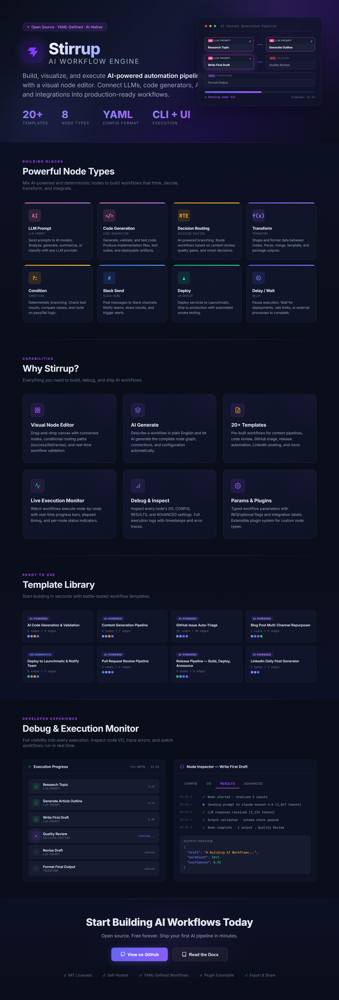

<p align="center">
  
</p>

<p align="center">
  
  
  
  
  
</p>

<h1 align="center">Stirrup</h1>
<h3 align="center">AI Workflow Engine</h3>

<p align="center">
Build, visualize, and execute <b>AI-powered automation pipelines</b> with a visual node editor.<br/>
Connect LLMs, code generators, APIs, and integrations into production-ready workflows.
</p>

<p align="center">
  <b>35 Templates</b> &nbsp;&bull;&nbsp; <b>8 Core + 83 Plugin Node Types</b> &nbsp;&bull;&nbsp; <b>18 Plugins</b> &nbsp;&bull;&nbsp; <b>CLI + UI</b>
</p>

```bash
npm install -g stirrup-ai
```

---

## Powerful Node Types

Mix AI and deterministic nodes to build workflows that think, fetch, branch, and deploy.

| | Type | What it does |
|---|---|---|
| **AI** | `llm-prompt` | Send a templated prompt to Claude, get text or structured JSON back |
| **AI** | `code-generation` | AI writes code in JS/TS/Python, optionally executes it in a sandbox |
| **AI** | `decision-routing` | AI evaluates data and picks the next branch from labeled options |
| **AI** | `agent-tool-use` | Autonomous agent with access to registered tools in a loop |
| **Deterministic** | `transform` | Evaluate a JavaScript expression on inputs |
| **Deterministic** | `condition` | Branch the workflow based on an expression result |
| **Deterministic** | `http` | Make HTTP requests to any API |
| **Deterministic** | `script` | Run JavaScript in a sandboxed VM with fetch, URL, and await support |

Plus 83 plugin node types: GitHub PRs/issues/repos, Slack messages, LinkedIn posts, Launchmatic deploys, Replicate image gen, git clone/branch/push, file scaffold, and more. All extensible through the [plugin system](#plugins).

---

## Why Stirrup?

### Visual Node Editor
Build workflows by dragging nodes onto a canvas, connecting them, and configuring each one with purpose-built form editors. No code required to get started.

### AI Generate
Describe what you want in plain English and Claude generates the complete workflow with nodes, connections, and configuration automatically.

### 35 Templates
Battle-tested templates for software development, DevOps, marketing, content, and operations. Highlights:

- **Dark Factory** — full-lifecycle enterprise software generation with multi-pass code gen, quality gates, and git delivery
- **Repo Momma** — nurturing repo improvement: measure twice, cut once, PR with care
- **Brownfield Mode** — analyze existing repos, generate fixes, open PRs, deploy previews
- Plus: PR reviews, deployment pipelines, LinkedIn posting, content repurposing, competitor monitoring, SEO briefs, and more

### Live Execution Monitor
Watch your workflow execute with real-time status updates. Nodes light up as they run, show timing, and display output data inline on the canvas.

### Debug & Inspect
When a node fails, click it to see the exact error, resolved inputs, and stack trace. Click **Analyze with AI** and Claude diagnoses the issue and suggests concrete field edits you can apply with one click.

### Params & Connections
Define typed workflow parameters with service bindings for auto-injected credentials and smart UI controls like the GitHub repo picker. Connect once, use everywhere.

### Interactive Tutorial
First-time users get a 15-step guided walkthrough that highlights each feature with a spotlight overlay and opens the real panels at each step. Reopenable anytime from the **?** button.

---

## Quick Start

```bash
# Install globally
npm install -g stirrup-ai

# Set your Anthropic API key
stirrup config set anthropicApiKey sk-ant-...

# Launch the visual editor
stirrup ui

# Or create a workflow from a template via CLI
stirrup init

# Run with parameters
stirrup run workflows/pr-review.yaml \
  --set repo=myorg/myrepo \
  --set prNumber=42
```

---

## How It Works

Workflows are YAML files that describe a directed acyclic graph. Each node is either deterministic or AI-powered. The engine executes them as a parallel DAG — independent nodes run concurrently, conditional branches are evaluated at runtime, and every step's state is persisted to SQLite.

```yaml
id: review-pipeline
name: Automated Code Review
version: "1.0"

params:
  - name: repo
    type: string
    required: true
    picker: github-repo
  - name: prNumber
    type: number
    required: true
  - name: githubToken
    type: string
    service: github

nodes:
  - id: fetch-diff
    type: http
    name: Fetch PR Diff
    inputs:
      - from: context.repo
        to: repo
    config:
      url: "https://api.github.com/repos/{{repo}}/pulls/{{pr}}"
      method: GET

  - id: review
    type: llm-prompt
    name: AI Code Review
    inputs:
      - from: nodes.fetch-diff.outputs.body
        to: diff
    config:
      promptTemplate: |
        Review this pull request for bugs and security issues:
        {{diff}}

  - id: route
    type: decision-routing
    name: Severity Check
    inputs:
      - from: nodes.review.outputs.response
        to: review
    config:
      prompt: "Are there critical issues? {{review}}"
      branches:
        block: "Critical issues found"
        approve: "Clean code"

edges:
  - from: fetch-diff
    to: review
  - from: review
    to: route
```

---

## Dark Factory

The **Dark Factory for Enterprise Software** is Stirrup's flagship template — a complete software development lifecycle in a single workflow.

### How it works

```
Requirements Discovery → Solution Architecture →
  ┌─ Layer 1: Infrastructure (parallel) ─┐
  └─ Layer 2: Data Models (parallel) ────┘
                    ↓
       Layer 3: Business Logic (sees Layer 2 types)
                    ↓
       Layer 4: API Routes (sees Layers 2+3 interfaces)
                    ↓
              Merge → Quality Review → Refine (conditional)
                    ↓
            Completeness Sweep → Unit Tests + Integration Tests (parallel)
                    ↓
       Security Audit → Production Review → Hardening (conditional)
                    ↓
         Documentation → Assemble → Final Assessment → Git Push
```

**23 nodes, 32 edges.** Sequential-aware code generation means each layer sees the actual types and interfaces from prior layers — imports, method signatures, and DTOs are correct by construction. Dual quality gates route to refinement or hardening only when needed. Output is scaffolded to disk, pushed to a new GitHub repo.

**Validated output quality:** Scored A grade (95 requirements, 92 code quality, 93 integration, 90 production readiness) on enterprise REST API generation across multiple test runs.

### Variants

| Template | Nodes | Approach |
|----------|-------|----------|
| `dark-factory-enterprise` | 23 | Production — sequential-aware + git delivery |
| `dark-factory-brownfield` | 16 | Analyze existing repo → fix → PR → deploy |
| `repo-momma` | 17 | ONE perfect improvement per run, self-review gate |
| `dark-factory-v2` | 18 | Archive — parallel 4-layer |
| `dark-factory-v3` | 19 | Archive — sequential-aware baseline |
| `dark-factory-v4` | 23 | Archive — experimental test-driven feedback |

---

## Template Library

35 ready-made workflow templates across 5 categories.

### Software Development
| Template | What it does |
|----------|-------------|
| **Dark Factory Enterprise** | Full-lifecycle software generation: requirements → architecture → multi-pass code gen → quality gates → tests → security → hardening → docs → git push |
| **Dark Factory Brownfield** | Clone repo, analyze codebase, identify improvements, generate fixes, open PR, deploy preview to Launchmatic |
| **Repo Momma** | Nurturing repo improvement — deep health check, measure gaps, pick ONE improvement, implement with care, self-review, PR |
| **AI Code Gen & Validation** | Generate code from spec, review quality, produce deployment-ready output |
| **PR Review Pipeline** | Fetch diff, AI review, severity routing, post results |
| **PR Merge Deploy** | On PR merge, deploy to staging, run smoke tests, update PR with status |

### DevOps & Infrastructure
| Template | What it does |
|----------|-------------|
| **Deploy & Notify** | Deploy to Launchmatic, run browser smoke tests, post results to Slack |
| **Release Pipeline** | GitHub release, deploy to production, screenshot result, announce in Slack |
| **Self-Deploy to Launchmatic** | Package any Stirrup workflow as a standalone hosted service |
| **Uptime Monitor** | Check URL on schedule, log metrics, alert in Slack on downtime |
| **GitHub Issue Auto-Triage** | Classify issues, add labels, assign priority, notify team in Slack |

### Content & Marketing
| Template | What it does |
|----------|-------------|
| **Multi-Platform Launch Broadcast** | Fan out to LinkedIn, X, Facebook, TikTok, YouTube in parallel |
| **Blog Multi-Channel Repurposer** | Fetch blog post, atomize into Twitter thread, LinkedIn, newsletter, YouTube script |
| **AI Image Campaign** | Write 4 platform-tailored image prompts, generate via Replicate, pick winners, schedule posts |
| **LinkedIn Daily Post** | Topic in, LinkedIn-tailored post out, published directly |
| **LinkedIn Thought Leader** | RSS feed → AI commentary → publish to LinkedIn |
| **SEO Content Brief** | SERP analysis → AI generates content brief with keyword strategy |
| **Content Pipeline** | Research → outline → draft → quality review → revision → publish |

### Analytics & Monitoring
| Template | What it does |
|----------|-------------|
| **Weekly Repo Analytics** | PR/issue stats, top contributors, AI summary to Slack |
| **Repo Health Broadcast** | GitHub stats → AI update → branded image → LinkedIn + Slack |
| **LinkedIn Engagement Digest** | Pull post stats, analyze what's working, weekly digest to Slack |
| **Competitor Changelog Watcher** | Fetch RSS, AI strategic summary, post to Slack |

### Operations
| Template | What it does |
|----------|-------------|
| **Customer Support Automation** | Classify tickets, route to team, auto-generate responses |
| **Incident Triage & Response** | Parse alert, classify severity, run diagnostics, create response plan |
| **Customer Feedback Router** | Classify sentiment, route negative to GitHub issues + Slack, positive to LinkedIn testimonial |
| **Data ETL Pipeline** | Extract from API, AI-powered enrichment, load to destination |

Plus smoke tests, meta-validators, and more. Browse all 35 in the UI or run `stirrup init`.

---

## Debug & Execution Monitor

Full visibility into every execution. Inspect node-by-node results, see exact inputs and outputs, and diagnose failures with AI assistance.

- **Real-time progress** — SSE-powered node status updates as the workflow runs
- **Node inspector** — click any node to see config, inputs, outputs, and timing
- **AI-powered debugging** — Claude reads the error, config, and inputs, then suggests specific fixes
- **One-click apply** — review the AI's suggested edits with before/after diffs and apply them directly to the workflow
- **Isolated retry** — re-run a single failed node with modified inputs without re-executing the entire workflow

---

## Service Connections

Connect once, use everywhere. Credentials are stored locally (`~/.stirrup/tokens.json`, 0600 permissions) and auto-injected into any workflow that declares a matching `service` param. Repo params use a smart GitHub picker — no URL typing.

| Service | Auth method | What it powers |
|---------|------------|----------------|
| **GitHub** | OAuth device flow or `gh` CLI | PRs, issues, code search, repo picker, repo creation |
| **Launchmatic** | `lm login` browser flow or manual paste | Deploy, databases, domains, browser tests |
| **Anthropic** | API key (or `ANTHROPIC_API_KEY` env var) | Every AI node |
| **Slack** | Bot User OAuth Token (`xoxb-`) with guided setup | Messages, files, channels |
| **LinkedIn** | OAuth token | Post to feed, org pages, engagement stats |
| **Stripe** | Secret key or `stripe` CLI | Charges, customers, payments |
| **Replicate** | API token | Image generation (Flux), any hosted model |
| **Typefully** | API key | Schedule X/Twitter threads + LinkedIn posts |
| **Buffer** | Access token | Schedule to Facebook, Instagram, Threads |
| **AWS** | `aws configure` CLI | S3, Lambda, DynamoDB |
| **Google Cloud** | `gcloud auth login` CLI | GCS, BigQuery, Cloud Run |

Environment variables (e.g., `ANTHROPIC_API_KEY`, `GITHUB_TOKEN`) are detected automatically.

---

## CLI Reference

```
stirrup <command> [options]

Workflows
  stirrup run <workflow>          Execute a workflow by ID or file path
  stirrup list                    List available workflow definitions
  stirrup validate <file>         Validate a workflow YAML/JSON file
  stirrup init                    Scaffold a new workflow from templates

Execution
  stirrup status [execution-id]   Show execution state(s)
  stirrup resume <execution-id>   Resume a paused or failed execution

Deployment
  stirrup serve                   Run workflows as a persistent HTTP service
  stirrup export <workflow>       Export as a standalone deployable project
  stirrup ui                      Launch the visual editor

Configuration
  stirrup config set <key> <val>  Set a configuration value
  stirrup config get [key]        Show configuration
  stirrup plugin <subcommand>     Manage plugins
```

---

## Deployment

### As a Service

```bash
stirrup serve --port 3711
```

### As a Standalone Project

```bash
stirrup export templates/pr-review.yaml -o ./deploy --format docker
```

### As an Embedded SDK

```typescript
import { WorkflowEngine, WorkflowBuilder, SqliteStateStore } from "stirrup-ai";

const engine = new WorkflowEngine({
  definitionsDir: "./workflows",
  stateStore: new SqliteStateStore("./data.db"),
});

const result = await engine.execute("my-workflow", {
  repo: "myorg/myrepo",
  prNumber: 42,
});
```

### Deploy to Launchmatic

Export and deploy directly from the UI — click Export, choose "Deploy to Launchmatic", and your workflow runs as a persistent hosted service with environment variables auto-configured.

---

## Agent Integration

Stirrup is built for AI agents to use. An agent can discover node types, construct workflows, validate them, execute with parameters, and inspect results — all through structured APIs.

### MCP Server

```json
{
  "mcpServers": {
    "stirrup": {
      "command": "stirrup-mcp",
      "env": { "WORKFLOWS_DIR": "./workflows" }
    }
  }
}
```

### WorkflowBuilder API

```typescript
import { WorkflowBuilder } from "stirrup-ai";

const workflow = new WorkflowBuilder("etl-pipeline", "Data ETL")
  .param("sourceUrl", "string", { required: true })
  .http("extract", "Fetch Data", {
    url: "{{sourceUrl}}", method: "GET",
    inputs: [{ from: "context.sourceUrl", to: "sourceUrl" }],
  })
  .llmPrompt("enrich", "AI Enrichment", {
    promptTemplate: "Classify this data: {{data}}",
    inputs: [{ from: "nodes.extract.outputs.body", to: "data" }],
  })
  .edge("extract", "enrich")
  .build();
```

See [AGENT-USAGE.md](./AGENT-USAGE.md) for the complete integration guide.

---

## Plugins

18 built-in plugins with 83 node types and 16 tools auto-load on server start. Write your own with the PluginContext API:

```typescript
import type { PluginContext } from "stirrup-ai";

export default function register(ctx: PluginContext) {
  ctx.registerNodeType("my-node", async (config, execCtx) => {
    return { result: "done" };
  });

  ctx.registerTool({
    name: "my-tool",
    description: "A tool for agent nodes",
    inputSchema: { type: "object", properties: { query: { type: "string" } } },
    handler: async (input) => ({ rows: [] }),
  });
}
```

**Built-in plugins:** GitHub, Slack, LinkedIn, Launchmatic, Typefully, Buffer, Replicate, Webhook, Filesystem, Git, CSV/JSON, HTTP Auth, Scheduler, Logger, PostgreSQL, Redis, Email, S3

---

## Security

- **Path containment** — all file operations verify paths stay within allowed directories
- **SSRF protection** — HTTP node and git-clone block private IPs and non-HTTPS protocols
- **Token safety** — credentials never appear in error messages, logs, or event streams
- **Sandbox isolation** — script/transform nodes run in V8 vm contexts with hardened prototypes
- **CSRF protection** — auth routes require matching origin headers
- **Input normalization** — workflow definitions are sanitized before validation (prototype pollution prevention)
- **Host verification** — server binds to localhost only, blocks non-local requests

---

## Development

```bash
git clone https://github.com/PrincipalForce/stirrup.git
cd stirrup
npm install
cd ui && npm install && cd ..

npm test              # 48 tests across 9 suites
npm run build         # Build engine + CLI
npm run build:ui      # Build React UI
npm run build:all     # Build everything
npm run dev:ui        # Vite dev server with hot reload
```

---

## Contributing

We welcome contributions. See [CONTRIBUTING.md](./CONTRIBUTING.md) for setup instructions.

Good first contributions:
- New workflow templates in `templates/`
- Node type plugins
- UI improvements
- Documentation

---

## License

MIT — see [LICENSE](./LICENSE)

Open source. Free forever. Self-hosted.

Built by [PrincipalForce](https://github.com/PrincipalForce).
